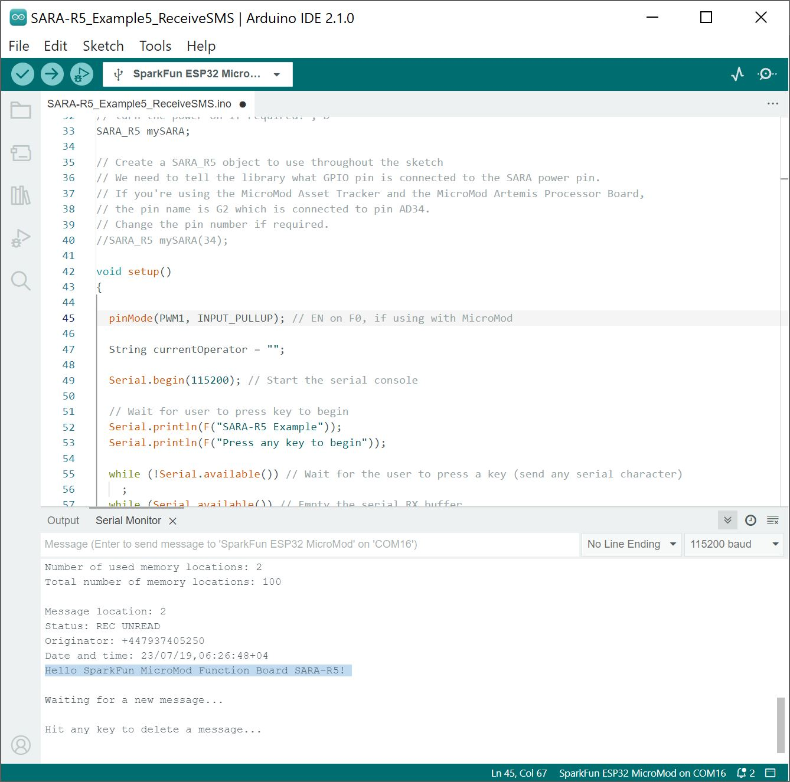

<!--

  <table>
    <tr align="center">
     <td></td>
    </tr>
  </table>

-->

The SparkFun u-blox SARA-R5 Arduino Library includes several examples to cover how to configure and use different features of the SARA-R5 module.

Make sure to go through the following examples to get the SARA-R5 registered and configured properly on your mobile network:

- Example 3 - Network Info
- Example 4 - Register Operator
- Example 7 - Configure Packet Switched Data

### Example 1 - GNSS GPRMC

The first example enables the GNSS receiver and reads the GPRMC message for position, speed and time data. Open the example by navigating to **File** > **Examples** > **SparkFun u-blox SARA-R5 Arduino Library** > **SARA-R5_Example1_GNSS_GPRMC**.

Select your board in the Tools menu (in our case **SparkFun ESP32 MicroMod**) and the correct Port it enumerated on and click "Upload". After uploading the code, open the [Serial Monitor](https://learn.sparkfun.com/tutorials/terminal-basics) or terminal emulator of your choice with the baud rate set to **115200**. The code waits for a keyboard input from the user before progressing and running the setup and loop. After user input, the code prints out GPS data every second when there is a GPS lock.

  <table>
    <tr align="center">
     <td></td>
    </tr>
  </table>

!!!note
    Heads up! Make sure your GNSS antenna has a clear view of the open sky. Placing the antenna outdoors away from large objects (buildings, large trees, etc.) is best but if necessary you can usually place the antenna in a window that has a view of the sky to get a lock.

####Code to Note

This function organizes the GPS data to print out neatly whenever the data returns as valid:

    void printGPS(void)
    {
      Serial.println();
      Serial.println("UTC: " + String(gps.utc));
      Serial.print("Time: ");
      if (clk.time.hour < 10) Serial.print('0'); // Print leading 0
      Serial.print(String(clk.time.hour) + ":");
      if (clk.time.minute < 10) Serial.print('0'); // Print leading 0
      Serial.print(String(clk.time.minute) + ":");
      if (clk.time.second < 10) Serial.print('0'); // Print leading 0
      Serial.print(String(clk.time.second) + ".");
      if (clk.time.ms < 10) Serial.print('0'); // Print leading 0
      Serial.println(String(clk.time.ms));
      Serial.println("Latitude: " + String(gps.lat, 7));
      Serial.println("Longitude: " + String(gps.lon, 7));
      Serial.println("Speed: " + String(spd.speed, 4) + " @ " + String(spd.cog, 4));
      Serial.println("Date (MM/DD/YY): " + String(clk.date.month) + "/" +
        String(clk.date.day) + "/" + String(clk.date.year));
      Serial.println("Magnetic variation: " + String(spd.magVar));
      Serial.println("Status: " + String(gps.status));
      Serial.println("Mode: " + String(gps.mode));
      Serial.println();
    }

### Example 2 - Identification

The second example prompts the LTE module to read the SARA-R5's identification information:

- Manufacturer ID
- Model
- Firmware Version
- Serial Number
- IMEI ID
- IMSI ID
- SIM CCID
- Subscriber Number (from the SIM)
- Capabilities
- SIM state

This example primarily functions as a check to make sure the SARA-R5 is working properly and the SIM card is detected then polls the SIM status in the main loop. Upload the code and open a terminal window with the baud set to **115200**. The code initializes the SARA-R5 and after a user input, initializes the SARA-R5 and prints out the ID information and SIM state.

Open the example by navigating to **File** > **Examples** > **SparkFun u-blox SARA-R5 Arduino Library** > **SARA-R5_Example2_Identification**.

If you have not already, select your board in the Tools menu (in our case **SparkFun ESP32 MicroMod**) and the correct Port it enumerated on and click "Upload". After uploading the code, open the Serial Monitor with the baud rate set to **115200**. Again, the code waits for a keyboard input from the user before progressing and running the setup and loop.

Make sure to wait for the blue NI LED to light up first before sending a character through the terminal window. Once there is a network in range, send a character to run the example. You will see the SARA-R5's identification information printed out.

  <table>
    <tr align="center">
     <td></td>
    </tr>
  </table>

### Example 3 - Network Info

This example verifies the SARA-R5 is receiving an LTE signal on a selected network and prints out the network information and IDs. The code creates the SARA-R5 object and assigns a network operator value. Depending on the network for your SIM card uses, adjust this line:

    const mobile_network_operator_t MOBILE_NETWORK_OPERATOR = MNO_GLOBAL;

Open the example by navigating to **File** > **Examples** > **SparkFun u-blox SARA-R5 Arduino Library** > **SARA-R5_Example3_NetworkInfo**.

If you have not already, select your board in the Tools menu (in our case **SparkFun ESP32 MicroMod**) and the correct Port it enumerated on and click "Upload". After uploading the code, open the Serial Monitor with the baud rate set to **115200**. Wait for the blue NI LED to light up and then send a keyboard input.

After initializing everything needed, the code attempts to set the Network Profile to the Mobile Network Operator entered. If successful, the code prints out the RSSI (Received Signal Strength), Network Registration Status and Context IDs, Access Point Names and IP Addresses.

  <table>
    <tr align="center">
     <td></td>
    </tr>
  </table>

Depending on the output in the Serial Monitor, you may need to scroll down to view the Context ID, APN, and IP Address.

### Example 4 - Register Operator

Example 4 checks to see if the SARA-R5 is connected to a network and lets you register on a different network if available and if the SIM supports this. This example can also be used to list all the LTE operators the SARA-R5 can detect.

!!!note
    You can only connect to networks supported by your SIM card. Refer to your SIM card manufacturer's documentation for supported networks.

Open the example by navigating to **File** > **Examples** > **SparkFun u-blox SARA-R5 Arduino Library** > **SARA-R5_Example4_RegisterOperator**.

If you have not already, select your board in the Tools menu (in our case **SparkFun ESP32 MicroMod**) and the correct Port it enumerated on and click "Upload". After uploading the code, open the Serial Monitor with the baud rate set to **115200**. Wait for the blue NI LED to light up and then send a keyboard input.

  <table>
    <tr align="center">
     <td></td>
    </tr>
  </table>

### Example 7 - Configure Packed Switched Data

Example 7 configures the "Context Identifier" for the mobile data connection. Make sure to go through this example to properly set up your SARA-R5 Context ID.

Open the example by navigating to **File** > **Examples** > **SparkFun u-blox SARA-R5 Arduino Library** > **SARA-R5_Example7_ConfigurePacketSwitchedData**.

If you have not already, select your board in the Tools menu (in our case **SparkFun ESP32 MicroMod**) and the correct Port it enumerated on and click "Upload". After uploading the code, open the Serial Monitor with the baud rate set to **115200**. Wait for the blue NI LED to light up and then send a keyboard input. Then follow the prompts to select the appropriate Context ID. You may see a few Context IDs so make sure to select one that looks correct (i.e. not a blank IP):

  <table>
    <tr align="center">
     <td></td>
    </tr>
  </table>

The code provides a warning that “deactivate profile failed”. We see this because the SARA needs to disconnect from a profile before it can connect to a new one, and in this case this failed because there was no profile active. Don't worry about this warning, it is just there for information. The example shows that our connection was successful by displaying the Internet Protocol (IP) address the SARA has been allocated by the service operator.

### Example 5 - Receive SMS

The fifth example demonstrates how to read and print any SMS text messages the SARA-R5 receives. The code checks whether the module is connected to an operator and will freeze if unsuccessful. If the code freezes here, wait and retry as it may be a connection issue with your network. Otherwise, return to Examples 3 and 4 to set up the Network Operator.

Open the example by navigating to **File** > **Examples** > **SparkFun u-blox SARA-R5 Arduino Library** > **SARA-R5_Example5_ReceiveSMS**.

The main loop accesses the message storage memory used for reading and deleting messages for data and prints the used and total number of memory locations in the message storage.

The code waits for any new messages to arrive and prints the Message Index (location), Status, Originator, Date and Time and then the message contents.

New messages are automatically marked as read once the code prints them. To force the code to print all the messages stored in the message memory, comment out this line:

    if (unread == "REC UNREAD")

If you have not already, select your board in the Tools menu (in our case **SparkFun ESP32 MicroMod**) and the correct Port it enumerated on and click "Upload". After uploading the code, open the Serial Monitor with the baud rate set to **115200**. Wait for the blue NI LED to light up and then send a keyboard input.

Assuming that you registered and activated your Hologram SIM card, log into your Hologram account. Head to the **Devices** and select the SIM card. Then select the **Messaging** tab and write message. Hit **Send SMS message** button.

  <table>
    <tr align="center">
     <td></td>
    </tr>
  </table>

If all goes well, you will notice that the message was sent successfully!

  <table>
    <tr align="center">
     <td></td>
    </tr>
  </table>

Head back to you Arduino Serial Monitor to view the message. You should see the message that was originally written in the Serial Monitor. Sweet!

  <table>
    <tr align="center">
     <td></td>
    </tr>
  </table>

Before moving onto the next example, make sure to keep track of the "Originator". This is the number that is associated with the SIM card and your Hologram account.

### Example 6 - Send SMS

!!!note
    Depending on your network, you may have issues sending a SMS message to a smartphone. Even if you have the correct phone number entered and you receive a response that the message was sent successfully to your network, the service carrier may block the message from being sent to your smartphone. For more information, check out the article about [Troubleshooting Undelivered SMS Messages Sent To or From a Hologram Device](https://support.hologram.io/hc/en-us/articles/360047721933-Troubleshooting-undelivered-SMS-messages-sent-to-or-from-a-Hologram-device).

The sixth example sends SMS messages to another phone or LTE module from the SparkFun LTE GNSS Function Board - SARA-R5. The code prompts the user for the destination number and message contents.

Open the example by navigating to **File** > **Examples** > **SparkFun u-blox SARA-R5 Arduino Library** > **SARA-R5_Example6_SendSMS**.

If you have not already, select your board in the Tools menu (in our case **SparkFun ESP32 MicroMod**) and the correct Port it enumerated on and click "Upload". After uploading the code, open the Serial Monitor with the baud rate set to **115200**. Wait for the blue NI LED to light up and then send a keyboard input. Enter the message that you want to send and the destination number.

  <table>
    <tr align="center">
     <td></td>
    </tr>
  </table>

Assuming that you are using a Hologram SIM card, head back to your Hologram account. Expand the window where it says "All activity". You should see the original message that was sent from the SARA-R5!
