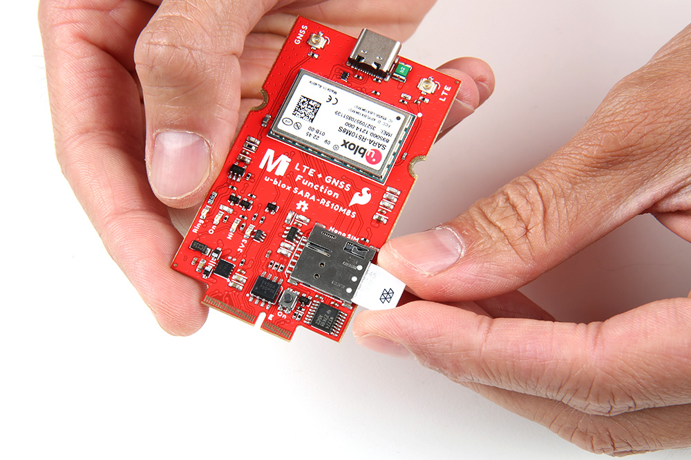
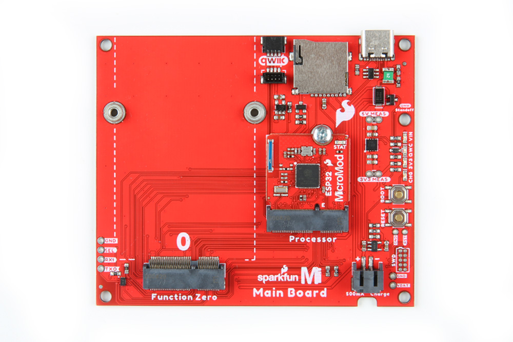
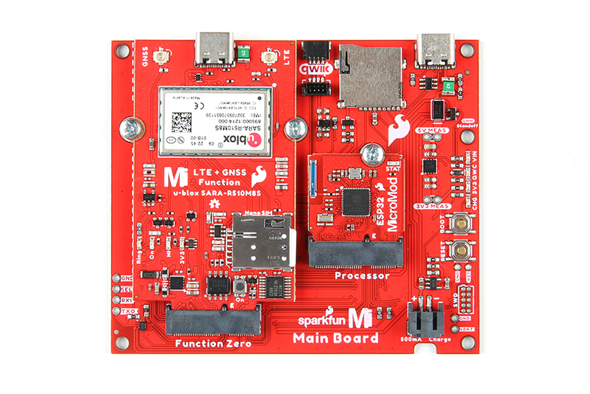
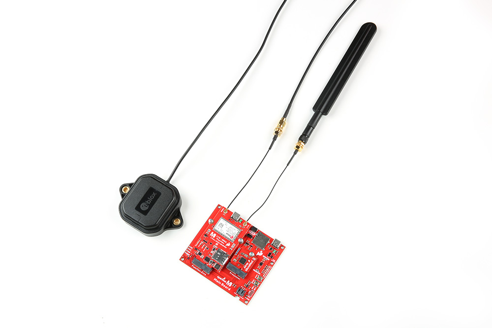
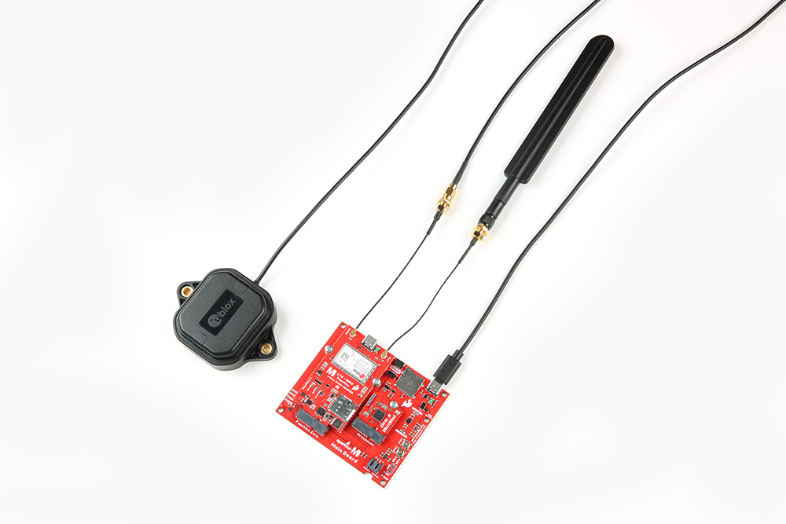

If you have not already, make sure to check out the Getting Started with MicroMod: Hardware Hookup for information on inserting your Processor and Function Boards to the Main Board.

  <table>
    <tr>
      <td>
        <a href="https://learn.sparkfun.com/tutorials/getting-started-with-micromod#hardware-hookup">
          

          

          <h3 style="text-align: left">
            <b>Getting Started with MicroMod: Hardware Hookup</b>
          </h3>
        </a>
      </td>
    </tr>
  </table>
  

### Inserting a SIM Card

!!!note
    ####Activate Your Hologram SIM
    If you're using a SIM card from Hologram, you'll need to follow a few quick steps to activate your SIM card.
    <ol>
      <li><a href="https://dashboard.hologram.io/">Log in</a> to your Hologram account, or <a href="https://dashboard.hologram.io/account/register">create one</a>.</li>
      <li>Click the blue <strong>+ Activate SIM</strong> button in the upper-right-corner of your Dashboard.</li>
       
      
 

       
      <li>Select your plan – in most cases “Maker Flexible” is the way to go, but you can upgrade.</li>
      <li>Enter your SIM card’s CCID. This number can be found printed on both your nano-SIM card and in the larger digits below the bar code. Then select continue.</li>
      <li>Next you can decide whether to enable auto-refill or not and continue. Finally, you’ll be greeted with a summary page – hit “Activate” and you’re ready to go!</li>
    </ol>
    
For more help activating your Hologram SIM card, check out their <a  href="https://hologram.io/docs/guide/connect/connect-device/">Connect Your Device</a> documentation.

Insert the SIM card into the nano SIM socket until it clicks. In this case, we used a [Hologram card](https://www.sparkfun.com/products/17117).

  <table>
    <tr align="center">
     <td></td>
    </tr>
  </table>

### Processor Board

Align the Processor Board's key into its M.2 connector's socket. Insert the board at an angle (~25°), push down, and tighten the screw. In this case, we had the MicroMod ESP32 Processor Board secured in the M.2 connector socket. Depending on your application, you may have a different Processor Board.

  <table>
    <tr align="center">
     <td></td>
    </tr>
  </table>

!!!note
    There are a variety of MicroMod Processor Boards available. However, we recommend using the ESP32, Artemis, and SAMD51 Processor Boards as these were tested to work with the SARA-R5. For the scope of this tutorial, we will be using the ESP32 Processor Board. The caveat when using the ESP32 Processor Board is that you will need to configure the pin that is connected to the voltage regulator's enable pin. This pin is used to upload code and when the ESP32 boots up. After uploading code and/or when the ESP32 has finished booting up, you will need to configure the pin as an input pullup in the `setup()`.

### Function Board

Align the Function Board's key into its M.2 connector's socket. Insert the board at an angle (~25°), push down, and tighten one of the screw to hold the board down. Attach the second screw on the other side of the board. Once the board is aligned, tighten both screws fully to secure the board.

  <table>
    <tr align="center">
     <td></td>
    </tr>
  </table>

### Attaching Antennas

Once the Function Boards are secure, attach any remaining cables, antennas, or components that your application may need. In this case, we would need to attach the LTE antenna, GNSS antenna, and a u.FL to SMA adapter for each antenna. For each antenna, connect the SMA connectors together and secure the connection using the hex nut until it is finger-tight. Then plug in the u.FL side of the cable into the board's u.FL connector. If you need tips on plugging in the U.FL connector, then check out our [U.FL tutorial](https://learn.sparkfun.com/tutorials/three-quick-tips-about-using-ufl).

  <table>
    <tr align="center">
     <td></td>
    </tr>
  </table>

### USB Cable

Last but not least, insert a cable to the Main Board's USB port. This is useful for programming the ESP32 Processor Board, power, and serial communication.

  <table>
    <tr align="center">
     <td></td>
    </tr>
  </table>

!!!note
    The USB port on the SARA-R5 Function Board is for diagnostics and is currently unavailable. While you can connect to the port for power, there currently is not much support for the diagnostics.
