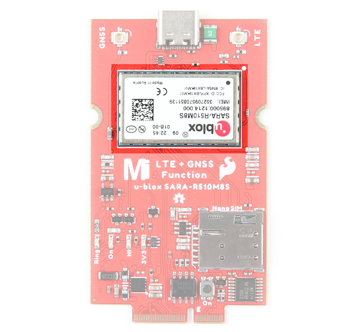
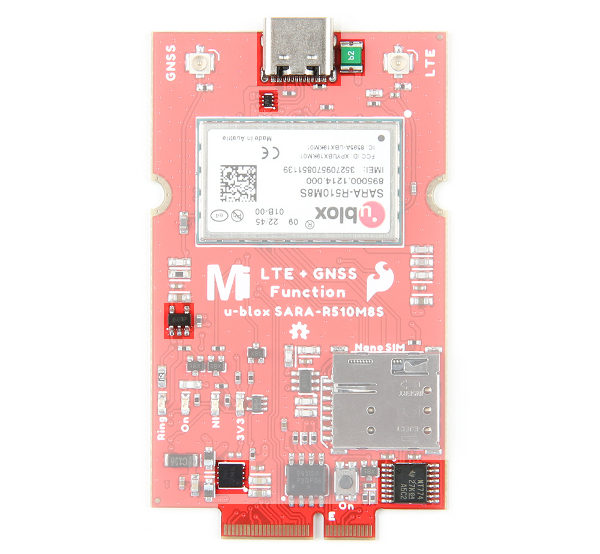
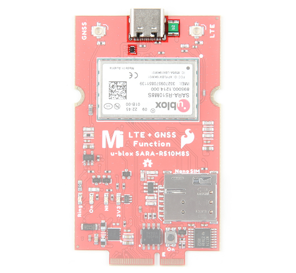
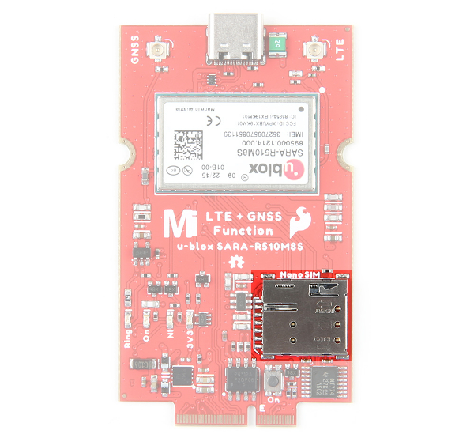
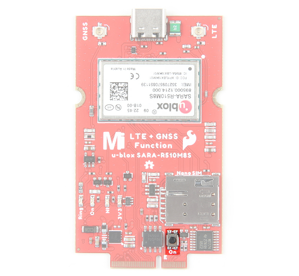
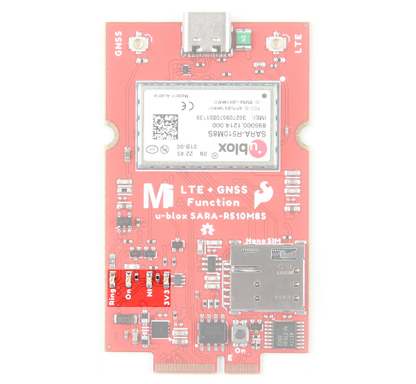
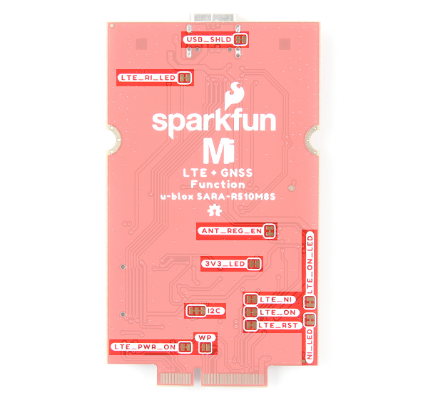
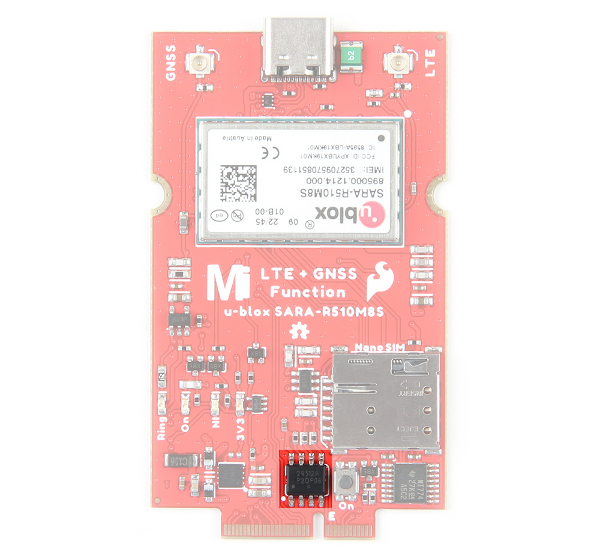
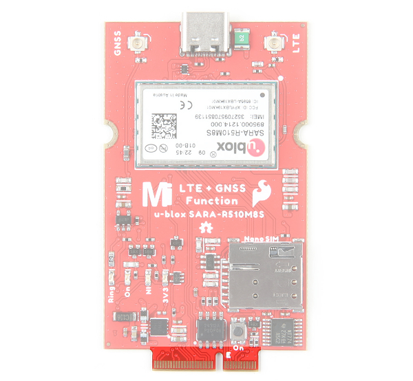
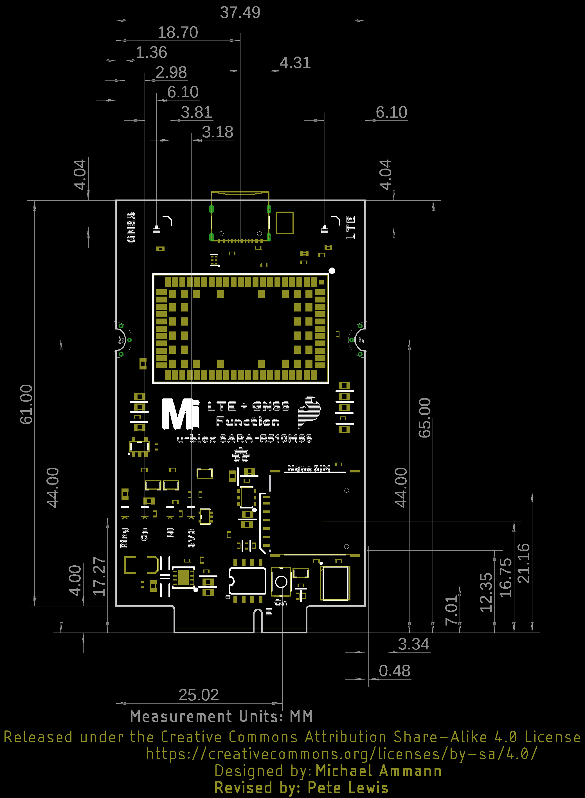

We've broken out the SARA-R5 module (specifically the **SARA-R510M8S-01B**) to a MicroMod Function Board. Due to the design of the Function Board, we've rotated the board 180° relative to the label in the image shown below. In this section, we will highlight relevant components on the board. For more information about the u-blox SARA-R510M8S module, make sure to check the Resources tab.

  <table>
    <tr align="center">
     <td></td>
    </tr>
  </table>

### Power

The Function Board receives power typically from MicroMod Main Board's M.2 socket. Depending on your application, power can be provided via the Main Board's USB or a single cell LiPo Battery. If the Function Board's USB is also connected, a Schottky protection diode (the little rectangular black IC by the USB C connector) is included to prevent conflicting voltages. A resettable fuse is also included next to the USB connector as well. Power for the system is regulated down for the function board from the 3.3V AP7361C voltage regulator (square IC by the bottom left of the board). A dedicated 3.3V AP2112K voltage regulator (5-pin black IC) is also provided when using an active GNSS antenna. Additionally, the board includes an IC for voltage level translation (16 pin black IC on the bottom right of the board) for certain pins on the SARA-R510M8S.

  <table>
    <tr align="center">
     <td></td>
    </tr>
  </table>

### USB Type C Connector

Users can connect the module to a USB port. This can power the module as well. A Schottky protection diode is included to prevent conflicting voltages when the Main Board is connected to a power source. A resettable fuse is also provided. Compared to other u-blox modules, you will this is for the diagnostic interface and not to for flashing new firmware.

  <table>
    <tr align="center">
     <td></td>
    </tr>
  </table>

!!!note
    Please consult the [SARA R5 Integration Manual](https://cdn.sparkfun.com/assets/f/8/5/a/6/SARA-R5_SysIntegrManual__UBX-19041356_.pdf) for more details on using the diagnostic interface. You cannot (currently) upgrade the SARA via the diagnostic interface. Using the diagnostic interface is beyond the scope of this tutorial.

### u.FL Connectors for LTE and GNSS

The MicroMod Main Board was intended to be included in an enclosure. Thus, the function board includes two u.FL connectors for the LTE and GNSS antennas. You will need a [u.FL to SMA adapter](https://www.sparkfun.com/products/9145) for each antenna.

  <table>
    <tr align="center">
     <td></td>
    </tr>
  </table>

### Nano SIM Socket

To connect to an LTE network, you will need a nano SIM card.

  <table>
    <tr align="center">
     <td></td>
    </tr>
  </table>

### On Button

The "ON" button to configure the SARA-R5 power settings. There are three modes: power on, power saving mode (PSM), or power OFF. Press and hold the button down to enter each mode for about 3 seconds. When fully powered, the LED will be bright red. In power saving mode, the LED will dim. When powered off, the LED will turn off.

  <table>
    <tr align="center">
     <td></td>
    </tr>
  </table>

### LEDs

The board includes four status LEDs:

* **3.3V** &mdash; When lit, this indicates 3.3V power is available.
* **Ring** &mdash; When lit, this indicates when there is an event.
* **NI** &mdash; The LTE Network Indicator LED shows the cellular network status when the SARA-R5's GPIO1 is configured to act as a network status indicator output. The NI LED alternates from full Off (No service), full On (Data Transmission) as well as various pulse lengths to show different network statuses. Refer to section 17.1.3 of the AT Command Manual for the AT commands and description of this LED and the GPIO1/NI pin's behavior for different network states.
* **LTE ON** &mdash; The LTE ON LED indicates when the SARA-R5 module is powered on. When the LED is dim, this indicates that the SARA-R5 is in power saving mode. When the LED is off, the modules is powered off.

  <table>
    <tr align="center">
     <td></td>
    </tr>
  </table>

### Jumpers

!!!note
    Never worked with solder jumpers and PCB traces before or need a quick refresher? Check out our [How to Work with Solder Jumpers and PCB Traces](https://learn.sparkfun.com/tutorials/how-to-work-with-jumper-pads-and-pcb-traces) tutorial for detailed instructions and tips.

The back of the board includes various jumpers:

* **USB_SHLD** &mdash; By default, this jumper is closed and connects the USB Type C connector's shield pin to GND. Cut this to isolate the USB Type C connector's shield pin.
* **3V3_LED** &mdash; By default, this jumper is closed and connects to the output of the 3.3V voltage regulator. This is to indicate when 3.3V power is available for the SARA-R5 module. Cut this jumper to disable the 3.3V power LED and reduce the total current draw of the function board.
* **ANT_REG_EN** &mdash; By default, this jumper is closed and connects to the 3.3V AP2112K voltage regulator enable pin to the function board's general purpose I/O pin `F7`. The voltage regulator is controlled through software to provide power to an active GNSS antenna.
* **LTE_PWR_ON** &mdash; By default, this jumper is closed and connects the LTE power on pin to the function board's general purpose I/O pin `F5`. The LTE_PWR_ON pin is active low. This pin can be controlled through software or manually with the button.
* **LTE_ON_LED** &mdash; By default, this jumper is closed and connects to the LTE ON LED. Cut this to disable LED and reduce the total current draw of the function board.
* **LTE_ON** &mdash; By default, this jumper is closed and connects to the LTE ON pin to the function board's general purpose I/O pin `F1`. Cut this to disable LED and reduce the total current draw of the function board.
* **LTE_RST** &mdash; By default, this jumper is closed and connects the LTE reset pin to the function board's general purpose I/O pin `F2`. The LTE_RST pin is active low. This pin is controlled through software and will reset the SARA-R5 module.
* **NI_LED** &mdash;  By default, this jumper is closed and connects to the LTE network indicator pin to an LED. Cut this to disable LED and reduce the total current draw of the function board.
* **LTE_NI** &mdash; By default, this jumper is closed and connects the LTE network indicator pin to the function board's general purpose I/O pin `F0`. The LTE_NI pin is active low.
* **LTE_RI_LED** &mdash; By default, this jumper is closed and connects the UART Ring Indicator to an LED. Cut this jumper to disable the 3.3V power LED and reduce the total current draw of the function board.
* **I2C** &mdash;  By default, this three way jumper connects the 2.2k&ohm; pull-up resistors to the I2C data lines. Most of the time you can leave these alone unless your project requires you to [disconnect the pull-up resistors](https://learn.sparkfun.com/tutorials/i2c/all#i2c-at-the-hardware-level).
* **WP** &mdash;  By default, this jumper is open. Adding solder to the jumper pad will disable write protect for the EEPROM.

  <table>
    <tr align="center">
     <td></td>
    </tr>
  </table>

### EEPROM

The board includes an I2C EEPROM. Unfortunately, this is not available for the user and was meant to hold board specific information.

  <table>
    <tr align="center">
     <td></td>
    </tr>
  </table>

### Hardware Pinout

The LTE GNSS Function Board breaks out the SARA-R510M8S pins out to the edge of the board when connecting to a M.2 connector.

  <table>
    <tr align="center">
     <td></td>
    </tr>
  </table>

### Board Dimensions

The board uses the standard MicroMod Function Board size which measures about 37.49mm x 61.00mm (1.48" x 2.40").

  <table>
    <tr align="center">
     <td></td>
    </tr>
  </table>

