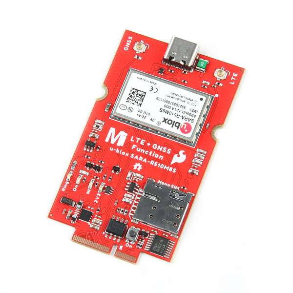

The [SparkFun SARA-R5 LTE GNSS Function Board](https://www.sparkfun.com/products/18431) is a robust development tool for u-blox&apos;s impressive SARA-R510M8S module. The SARA-R510M8S combines u-blox&apos;s UBX-R5 cellular chipset with their M8 GNSS receiver chipset to provide a 5G-Ready wireless IoT device complete with positioning data all on a single chip. As an asset tracker, the LTE GNSS Function Board offers Secure Cloud LTE-M communication for multi-regional use and has an integrated u-blox M8 GNSS receiver for accurate positioning information.

-   <a href="https://www.sparkfun.com/products/18431">
      <figure markdown>
        
      </figure>
    </a>

    ---

    <a href="https://www.sparkfun.com/products/18431">
      <b>SparkFun LTE GNSS Function Board - SARA-R5</b>
       
      DEV-18431
       
      
[Purchase from SparkFun :fontawesome-solid-cart-plus:](https://www.sparkfun.com/products/18431){ .md-button .md-button--primary }

    </a>

  <iframe width="560" height="315" src="https://www.youtube.com/embed/R37YaJobexs" title="YouTube video player" frameborder="0" allow="accelerometer; autoplay; clipboard-write; encrypted-media; gyroscope; picture-in-picture; web-share" allowfullscreen></iframe>

The UBX-R5 chipset supports many different forms of data communication from full TCP/IP sockets and packet switched data, through HTTP Get/Put/Post, FTP (the SARA has a built-in file system), or ping to good old SMS text messaging! The built-in u‑blox M8 GNSS receiver provides accurate and reliable positioning with a separate GNSS antenna interface for an external antenna. Both the GNSS antenna and LTE connections are made via a pair of u.FL connectors. A nano SIM card slot is also included as well.

Utilizing our handy M.2 MicroMod connector, no soldering is required to connect it to your system. Simply match up the key on your processor and function board's beveled edge connector to their respective key on the M.2 connector, then secure them to the Main Board with screws.

This Function Board provides access to the UART (default configuration) with a Processor Board. The USB pins are also broken out to a USB-C connector for diagnostic purposes. Status LEDs are included for 3.3V, Ring Indicator, LTE ON, and LTE Network Indicator. A button is included for LTE Power On.

### Required Materials

To follow along with this tutorial, you will need the following materials. You may not need everything though depending on what you have. Add it to your cart, read through the guide, and adjust the cart as necessary.

* 1x [SparkFun MicroMod - Single Board [DEV-20748]](https://www.sparkfun.com/products/20594)
* 1x [SparkFun MicroMod ESP32 Processor [WRL-16781]](https://www.sparkfun.com/products/16781)
    * There are a variety of MicroMod Processor Boards available. However, we recommend using the ESP32, Artemis, and SAMD51 Processor Boards as these were tested to work with the SARA-R5. For the scope of this tutorial, we will be using the ESP32 Processor Board. The caveat when using the ESP32 Processor Board is that you will need to configure the pin that is connected to the voltage regulator's enable pin. This pin is used to upload code and when the ESP32 boots up. After uploading code and/or when the ESP32 has finished booting up, you will need to configure the pin as an input pullup in the `setup()`.
* 1x [SparkFun LTE GNSS Function Board - SARA-R5 [DEV-18431]](https://www.sparkfun.com/products/18431)
* 1x USB-C cable
    * Our [USB 2.0 A to C Cable [CAB-15092]](https://www.sparkfun.com/products/15092) will do nicely
    * Our [USB 3.1 A to C Cable [CAB-14743]](https://www.sparkfun.com/products/14743) is a good choice too
* 1x SIM Card*
    * [Hologram SIM Card [CEL-17117]](https://www.sparkfun.com/products/17117)
* 1x [GNSS Multi-Band Magnetic Mount Antenna - 5m (SMA) [GPS-15192]](https://www.sparkfun.com/products/15192)
* 1x [LTE Hinged External Antenna - 698MHz-2.7GHz, SMA Male [CEL-16432]](https://www.sparkfun.com/products/16432)
* 2x [Interface Cable SMA to U.FL
 [WRL-09145]](https://www.sparkfun.com/products/9145)
* 1x [SparkFun Mini Screwdriver [TOL-09146]](https://www.sparkfun.com/products/9146)

!!! note "* Note"
    If you use your own SIM card, please check that your chosen service provider offers LTE-M coverage for your area before purchasing.

-   <a href="https://www.sparkfun.com/products/20748">
      <figure markdown>
        
      </figure>
    </a>

    ---

    <a href="https://www.sparkfun.com/products/20748">
      <b>SparkFun MicroMod - Single Board</b>
       
      DEV-20748
    </a>
<!-- ----------WHITE SPACE BETWEEN PRODUCTS---------- -->
-   <a href="https://www.sparkfun.com/products/16781">
      <figure markdown>
        
      </figure>
    </a>

    ---

    <a href="https://www.sparkfun.com/products/14743">
      <b>SparkFun MicroMod ESP32 Processor</b>
       
      WRL-16781
    </a>
<!-- ----------WHITE SPACE BETWEEN PRODUCTS---------- -->
-   <a href="https://www.sparkfun.com/products/18431">
      <figure markdown>
        
      </figure>
    </a>

    ---

    <a href="https://www.sparkfun.com/products/18431">
      <b>SparkFun LTE GNSS Function Board - SARA-R5</b>
       
      DEV-18431
    </a>
<!-- ----------WHITE SPACE BETWEEN PRODUCTS---------- -->
-   <a href="https://www.sparkfun.com/products/15092">
      <figure markdown>
       
      </figure>
    </a>

    ---

    <a href="https://www.sparkfun.com/products/15092">
      <b>USB 2.0 A to C Cable</b>
       
      CAB-15092
    </a>
<!-- ----------WHITE SPACE BETWEEN PRODUCTS---------- -->
-   <a href="https://www.sparkfun.com/products/17117">
      <figure markdown>
        
      </figure>
    </a>

    ---

    <a href="https://www.sparkfun.com/products/17117">
      <b>Hologram SIM Card</b>
       
      CEL-17117
    </a>
<!-- ----------WHITE SPACE BETWEEN PRODUCTS---------- -->
-   <a href="https://www.sparkfun.com/products/15192">
      <figure markdown>
        
      </figure>
    </a>

    ---

    <a href="https://www.sparkfun.com/products/15192">
     <b>GNSS Multi-Band Magnetic Mount Antenna - 5m (SMA)</b>
      
     GPS-15192
    </a>
<!-- ----------WHITE SPACE BETWEEN PRODUCTS---------- -->
-   <a href="https://www.sparkfun.com/products/16432">
      <figure markdown>
        
      </figure>
    </a>

    ---

    <a href="https://www.sparkfun.com/products/16432">
      <b>LTE Hinged External Antenna - 698MHz-2.7GHz, SMA Male</b>
       
      CEL-16432
    </a>
<!-- ----------WHITE SPACE BETWEEN PRODUCTS---------- -->
-   <a href="https://www.sparkfun.com/products/9145">
      <figure markdown>
        
      </figure>
    </a>

    ---

    <a href="https://www.sparkfun.com/products/9145">
      <b>Interface Cable SMA to U.FL</b>
       
      WRL-09145
    </a>
<!-- ----------WHITE SPACE BETWEEN PRODUCTS---------- -->
-   <a href="https://www.sparkfun.com/products/9146">
      <figure markdown>
        
      </figure>
    </a>

    ---

    <a href="https://www.sparkfun.com/products/9146">
      <b>SparkFun Mini Screwdriver</b>
       
      TOL-09146
    </a>
<!-- ----------WHITE SPACE BETWEEN PRODUCTS---------- -->  

!!! note
    The SMA connections on the antennas are standard polarity. Antennas with reverse-polarity connectors are not suitable when connecting to the LTE GNSS Function Board and u.FL to SMA cables.

### Suggested Reading

If you aren't familiar with the MicroMod Ecosystem, we recommend reading [here for an overview](https://www.sparkfun.com/micromod).

  <table style="border-style:none">
    <tr>
     <td>
     

     

    </td>
    </tr>
    <tr>
      <td>
<i><a href="https://www.sparkfun.com/micromod">MicroMod Ecosystem</a></i>
</td>
    </tr>
  </table>

If you aren’t familiar with the following concepts, we also recommend checking out a few of these tutorials before continuing.

-   <a href="https://learn.sparkfun.com/tutorials/getting-started-with-micromod">
      <figure markdown>
        
      </figure>
    </a>

    ---

    <a href="https://learn.sparkfun.com/tutorials/getting-started-with-micromod">
      <b>Getting Started with MicroMod</b>
    </a>

-   <a href="https://learn.sparkfun.com/tutorials/micromod-esp32-processor-board-hookup-guide">
      <figure markdown>
        
      </figure>
    </a>

    ---

    <a href="https://learn.sparkfun.com/tutorials/micromod-esp32-processor-board-hookup-guide">
      <b>MicroMod ESP32 Processor Board Hookup Guide</b>
    </a>

-   <a href="https://learn.sparkfun.com/tutorials/micromod-main-board-hookup-guide-v2">
      <figure markdown>
        
      </figure>
    </a>

    ---

    <a href="https://learn.sparkfun.com/tutorials/micromod-main-board-hookup-guide-v2">
      <b>MicroMod Main Board Hookup Guide V2</b>
    </a>

-   <a href="https://learn.sparkfun.com/tutorials/installing-an-arduino-library">
      <figure markdown>
        
      </figure>
    </a>

    ---

    <a href="https://learn.sparkfun.com/tutorials/installing-an-arduino-library">
      <b>Installing an Arduino Library</b>
    </a>

-   <a href="https://learn.sparkfun.com/tutorials/terminal-basics">
      <figure markdown>
        
      </figure>
    </a>

    ---

    <a href="https://learn.sparkfun.com/tutorials/terminal-basics">
      <b>Serial Terminal Basics</b>
    </a>

-   <a href="https://learn.sparkfun.com/tutorials/how-to-work-with-jumper-pads-and-pcb-traces">
      <figure markdown>
        
      </figure>
    </a>

    ---

    <a href="https://learn.sparkfun.com/tutorials/how-to-work-with-jumper-pads-and-pcb-traces">
      <b>How to Work with Jumper Pads and PCB Traces</b>
    </a>

